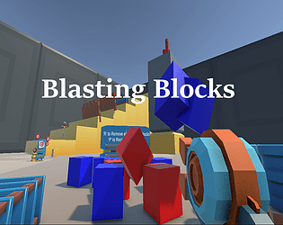

# Latios Framework Mini Demos

This repo contains a collection of small projects used to highlight some of the features of the Latios Framework.

## Feature Samples

This contains a collection of samples exploring specific features across the framework. These are the samples associated with some of the "Getting Started" guides.

The Feature samples use Unity 6000.0.23f1 and Latios Framework 0.11.4.

## Latios/Unity Comparison

These pair of projects provide a comparison setup between vanilla Unity and the Latios Framework, demonstrating the Latios Framework’s superior performance of transforms and rendering.

The projects use Unity 6000.0.23f1 and Entities 1.3.5. The Latios Framework version used is 0.11.4.

**Third-Party Notice:**

**All Assets within a directory named Unity_Companion_License_Assets come from one of the following locations:**

-   [**https://github.com/Unity-Technologies/EntityComponentSystemSamples**](https://github.com/Unity-Technologies/EntityComponentSystemSamples)
-   <https://assetstore.unity.com/packages/essentials/starter-assets-character-controllers-urp-267961>

**These assets are licensed under the Unity Companion License.**

## Blasting Blocks

This was a 48-hour jam game with a team of myself and a single designer. The version here has since been ridded of bugs that existed in the original submission. Because this was a jam game, the code is not particularly clean and does not employ the best performance practices. However, it does show Psyshock’s UnitySim in action combined with Myri, plus a spring-hovering kinematic character controller.

All assets are CC0:

-   Environment Models – \<kaylousberg.itch.io\>
-   Gun Model – \<quaternius.com\>
-   Audio – \<kenney.nl\>

The project uses Unity 6000.0.4f1 and Entities 1.2.1 and has been retrofitted to use the release version of Latios Framework 0.10.2.

## Scene Demo (Old)

This demo introduces the basic setup of a Latios Framework project. It also demonstrates scene management, `SubSystems`, Blackboard Entities, and the `LatiosWorld.syncPoint`.

The game is a multi-level navigation game with a persistent death counter.

Currently released for Unity 2020.3.0 and Latios Framework 0.3.

## Grid Demo (Old)

This demo introduces many of the powerful features of Latios Core, including `SuperSystems`, Explicit System Ordering, Hierarchical System Culling, Collection Components, and Custom Command Buffers.

The game is a turn-based strategy game which takes place on a 2D grid.

Currently released for Unity 2020.3.0 and Latios Framework 0.3.

## Color Demo (Old)

This demo introduces features from Psyshock and Myri, including Collider Modification, Psyshock Debug Tools, queries, the `FindPairs` Algorithm, `PhysicsComponentDataFromEntity`, and One-Shot Audio Sources. It also showcases Fluent Queries and an optimized method for instantiating and parenting entities using `InstantiateCommandBuffer`.

The simulation involves flying colliders which additively exchange color and play sound effects on collision.

Currently released for Unity 2020.3.0 and Latios Framework 0.3.

## Fireworks Demo (Old)

This demo introduces the new random number generation workflow as well as character controller and ballistic utilities in Psyshock. Myri is also on display in this demo.

The sandbox features a discrete kinematic FPS character controller with jumping and crouching abilities. Trigger toggles allow switching to a night mode where the gun is replaced with a fireworks launcher.

Currently released for Unity 2020.3.25 and Latios Framework 0.4.

## Got Questions?

Please reach out to me via Discord, GitHub Issues and Discussions, or the Unity forums. I’m here to help!
